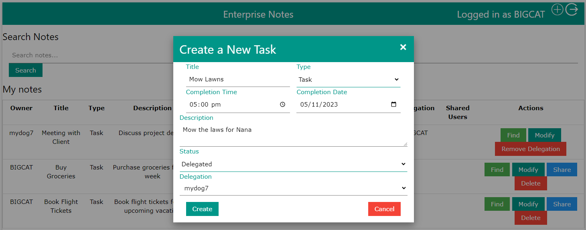
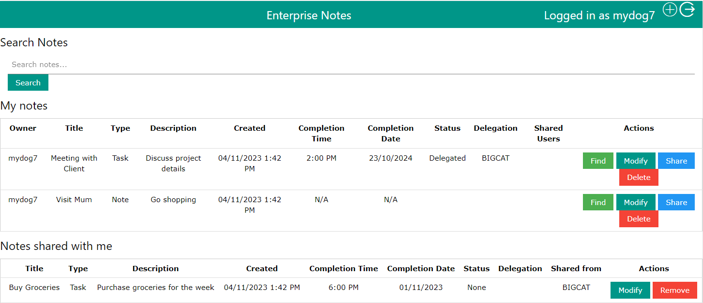

# Introduction

This aim of this project is to create a basic notes application - based off [pwrcost](https://github.com/yonush/pwrcost). It uses mostly built-in Go packages such as `net/http`, `database/sql`, `strconv`, `html/template` and uses third party packages `gorilla/mux` for the router, `jackc/pgx` for the PostegreSQL driver and `icza/session` for session management.

## Requirements to run application in an enterprise evironment

This application has been designed to run on any operating system and be accessible via any modern web browser, making it highly versatile. Our application's core logic, database interaction, and most of the processing are done on the server side. The application can be compiled to run on any popular server OS. This server-side processing is not dependent on the user's operating system or browser. This ensures that the core functionality is consistent across different platforms. The user interface is delivered through web pages. These web pages are rendered on the client-side using HTML, CSS, and JavaScript. Modern web standards ensure that web content is rendered consistently across various browsers and operating systems.

## Quick start guide

[Click here to view Quick Start Guide](docs/QuickStartGuide.md)

## This application requirements are as follows:</p>

> The Enterprise Notes application is an online service to users within an enterprise. The users will need to setup
> a new account within the Enterprise Note service. All users can create a note; the user who created a note is
> the owner of that note. All users have access to the list of registered users. A note can be shared with other
> users providing either read access or read/write access, which is set per user.
> Apart from metadata required to administer the note/task

-   A note just contains text (embedded media like video, images, etc is not required).
-   A note should have a name to aid with identification of the note.
-   The note should contain a date & time of creation.
-   And include a date & time of completion if it is a task.
-   The note/task should include a status flag to indicate if the task is none/in
    progress/completed/cancelled/delegated.
-   User id or name of the user the note was delegated to.

-   Go HTML templates with [W3.CSS](https://www.w3schools.com/w3css/w3css_examples.asp) stylesheet
-   RESTful API with gorilla/mux
-   Datastorage using PostgreSQL - tested with 15.4.1
-   Session management with icza/session
-   Create, Read, Update and Delete Notes/Tasks
-   Searching for Notes/Tasks based on attributes - Validation for Text Patterns from assignment brief was attempted, but not executed in application.
-   Share function for Notes/Tasks
-   Count occurrences of specified text snippets within a single Note/Task - Validation for Text Patterns from assignment brief was attempted, but not executed in application.

The application is standalone requiring no additional WAMP/LAMP dependencies. It has been built and tested on Windows. If the application requires rebuilding, there are two batch files provided. The rebuild assumes there is an existing Go installation on the host computer. The provided batch files will download the required 3rd party packages for the build process.

## Additional specifications that were missing but required to implement application

-   A note can only be delegated to one person. The owner and a user who has had a note shared with editing priveleges can delegate a note. The user who the note has been delegated to will have the permission to edit the title and description, and will be able to remove their delegation of the note.

-   Session management is not handled by Go's `net/http`. This was adressed using the third party package `icza/session`.

## Building

This application uses the Go programming language - where the latest was [Go 1.21](https://go.dev/dl/) as of writing this application. If you do not have Go installed on your system, you can acquire a copy from [Go.dev](https://go.dev/dl/). The go1.21.0.windows-amd64.msi was used to build this application.

### Database configuration

The app assumes a database exists - ESD. Edit the _dbsetup.go_ to change the default database name. Database defaults in the _dbsetup.go_ are shown below.

```go
const (
	host     = "localhost"
	port     = 5432
	user     = "postgres"
	password = ""
	dbname   = "postgres"
)
```

To run the server on your Windows system:

1. Run `buildpkg.cmd` in the root of the repo to build the binary (`notes.exe`) using non vendored packages
1. Run `buildvendor.cmd` in the root of the repo to build the binary (`notes.exe`) with the vendor
1. Run the binary `notes.exe` or used the run.cmd (has env variable set)
1. Browse to [http://localhost:8080](http://localhost:8080) to test the application out. If port 8080 does not work, you can start the app as follows using your console, where \*\*\*\* is your chosen port number.

    ```
        > ./notes.exe ****
    ```

### Non Windows

Testing has been performed on WSL & Linux but not MacOS. However, the commands in buildpkg.cmd and buildvendor.cmd can be run manually to build and run this demo.

#### Build by pkg

```bash
export GO111MODULE="on"
export GOFLAGS="-mod=mod"
go mod download
:: strip debug info during build
go build -ldflags="-s -w" .

```

#### Build by vendor

```bash
export GO111MODULE="on"
export GOFLAGS="-mod=vendor"
go mod vendor
:: strip debug info during build
go build -ldflags="-s -w"
```

### Dependencies

The application uses the following Go packages to build;

-   [Datastore: PostgreSQL driver](https://github.com/jackc/pgx/)
-   [HTTP router: Gorilla mux](https://github.com/gorilla/mux)
-   [Session Management: icza session](https://github.com/icza/session)
-   [Password Hashing: bcrypt](https://golang.org/x/crypto)
-   [Mock database for testing: go-sqlmock](https://github.com/DATA-DOG/go-sqlmock)
-   [Other testing packages: testify](https://github.com/stretchr/testify)

## Datastore

This version application requires a separate database to function - PostgreSQL. Demonstration Notes/Tasks are imported from a local CSV file in the local data folder. This will be imported when the application is run for the first time. Thereafter the application will use the database each time it is executed.

## Sample screens




## Session management

The application uses the [icza/session](https://github.com/icza/session) module to handle some basic sessions for the authentication.
